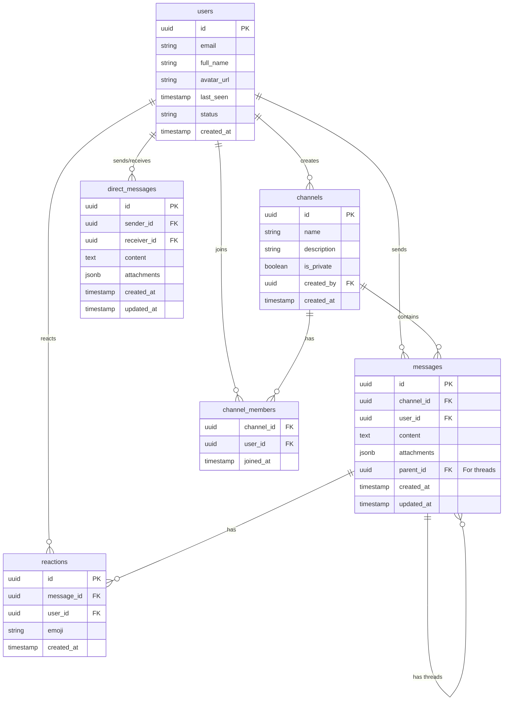

# AI Instructions

We are building a slack clone. Please follow the outlined instructions below.

## Tech Stack

- Next.js
- TailwindCSS
- Supabase
- Lucid
- Shadcn + Radix UI

## Functionalities

- Sign in / Sign up
- Real-time messaging
- Create/delete a new channel
- View all channels
- Send messages to a channel
- View messages in a channel
- Send files to a channel
- Send direct messages to a user
- Create threads from a message
- User reactions to a message
- User status

## Layout

The whole app is a single page app. No overflow. First screen is the sign in/sign up page. Upon authentication, the sidebar and main content are both scrollable. When viewing a channel's message, the most recent message is at the bottom of the page. Message reactions and threads icons are available on each message floating on the right side. Reactions and reply count to a message are displayed below the corresponding message in subscript. Reactions use emoji-picker-react package. 

- Header
    - Title
    - Search - centered. use shadcn command component for the search bar to fuzzy search for users and messages in channels and authorized direct messages. When a user is selected, the user's direct messages are displayed in the main content. When a channel is selected, the channel's messages are displayed in the main content. When a specific message is selected, the correct channel or direct message is shown and the message is scrolled to view for only one time in the main content.
    - Dark mode toggle - Sun/Moon icon
    - User menu - use shadcn/radix ui for the user menu. Only show a placeholder avatar with the user's initials. When clicked, a dropdown menu with a logout is displayed.

- Sidebar
    - Channels list - use shadcn/radix ui for the channels. When a channel is clicked, the channel's messages are displayed in the main content.
    - Direct messages list - use shadcn/radix ui for the direct messages. When a user is clicked, the user's direct messages are displayed in the main content.

- Main
    - Channel/User header - use shadcn/radix ui for the channel header. The channel header is sticky and sits at the top of the main content. When a channel header is clicked, the channels edit modal is displayed. There is also a button to delete the channel in the modal.
    - Channel/User messages - use shadcn/radix ui for the channel messages. The messages are displayed in a list format. The most recent message is at the bottom of the list. And the message list is displayed in a scrollable container starting from the bottom.
    - Channel/User message input - Messages are in rich text format utilizing quilljs but made to look like a shadcn/radix ui input. The message input is sticky and sits at the bottom of the main content. When pressing enter, the message is sent. When pressing shift+enter, a new line is created. There is also a separate input for threads.
    - Threads - use shadcn/radix ui for the threads. The thread of a selected message are displayed in a right closeable sidebar. The most recent message of the thread is at the bottom of the list. And the thread is displayed in a scrollable container starting from the bottom. The selected message is on the top of the thread.

### File structure 

This is only a skeleton and is subject to change. 

chatchipmunk/
├── public/
├── app/
│   ├── auth/
│   │   └── page.tsx
│   ├── channels/
│   │   └── page.tsx
│   ├── dm/
│   │   └── page.tsx
│   ├── layout.tsx
│   └── page.tsx
├── components/
│   ├── ui/
│   ├── emoji-picker.tsx
│   ├── message-input.tsx
│   ├── message-list.tsx
│   ├── message.tsx
│   ├── thread.tsx
│   └── toolbar.tsx
├── lib/
├── utils/
├── hooks/
└── middleware.ts

## Database Schema

